<h1 align="center">Hi there 👋 I'm Muhammad Ali Akbor</h1>
<h3 align="center">A MERN stack Developer from Bangladesh </h3>
 

<!--
**aliakborswe/aliakborswe** is a ✨ _special_ ✨ repository because its `README.md` (this file) appears on your GitHub profile.

Here are some ideas to get you started:

- 🔭 I’m currently working on ...
- 🌱 I’m currently learning Typescript
- 👯 I’m looking to collaborate on ...
- 🤔 I’m looking for help with ...
- 💬 Ask me about ...
- 📫 How to reach me: ...
- 😄 Pronouns: ...
- ⚡ Fun fact: ...
-->
